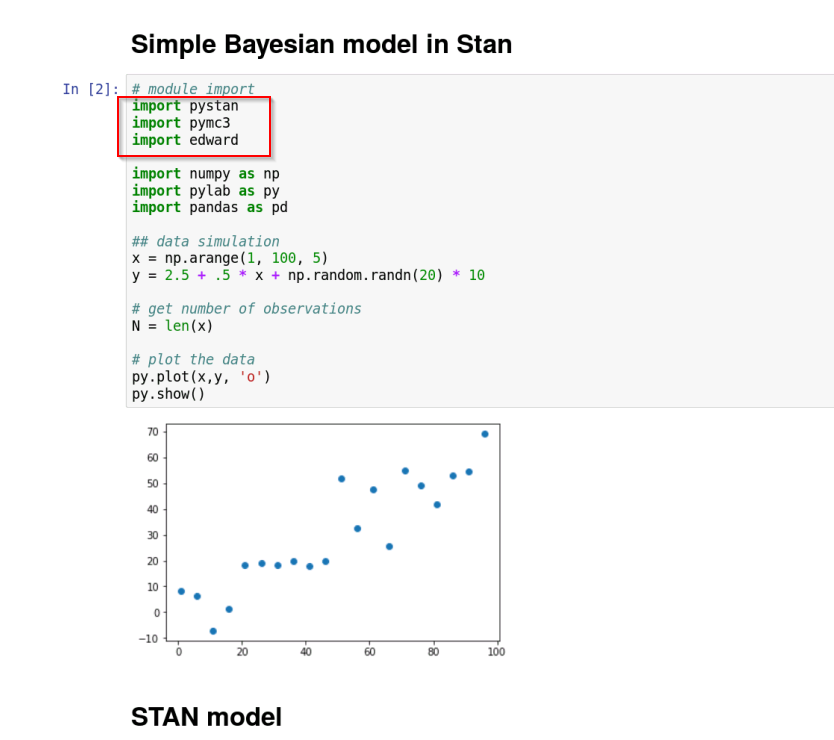
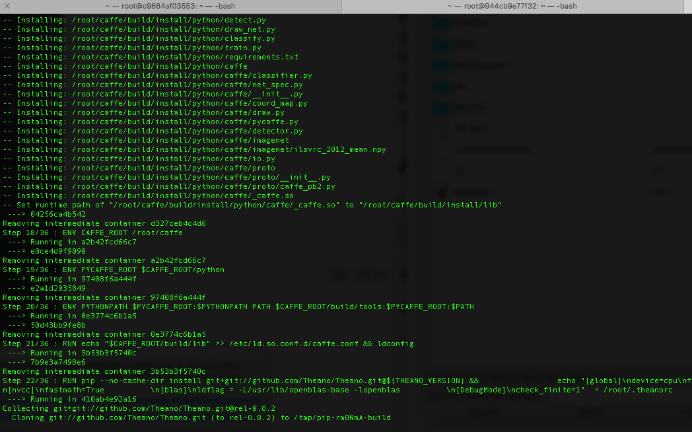

# All-in-one Docker image for Deep Learning, Bayesian Machine Learning and Distributed DataFrames

https://hub.docker.com/r/quantscientist/deep-ml-meetups/

This image is built automaticaly by a docker hub automation process. 

Image based on:
https://github.com/floydhub/dl-docker

(Work In progress) 
https://hub.docker.com/r/quantscientist/www.deep-ml.com/ 

# Image contents
On top of all the fancy deep learning libraries, this docker image contains:

* PyStan
* PyMC3
* Edward
* FB Prophet

* Dask
* Fastparquet
* LLVM
* LLDB
* Snappy
* Numba

# Get the image

docker pull quantscientist/deep-ml-meetups

# Run the image
docker run -it -p 8888:8888  -v /my-host-data-science-folder/:/root/sharedfolder quantscientist/deep-ml-meetups bash

# Run Jupyter
chmod +x run_jupyter.sh
./run_jupyter.sh

 
# Build the image

docker build -t docker pull quantscientist/deep-ml-meetups -f Dockerfile.cpu .

See https://github.com/docker/dceu_tutorials/blob/master/08-Automated-builds.md

